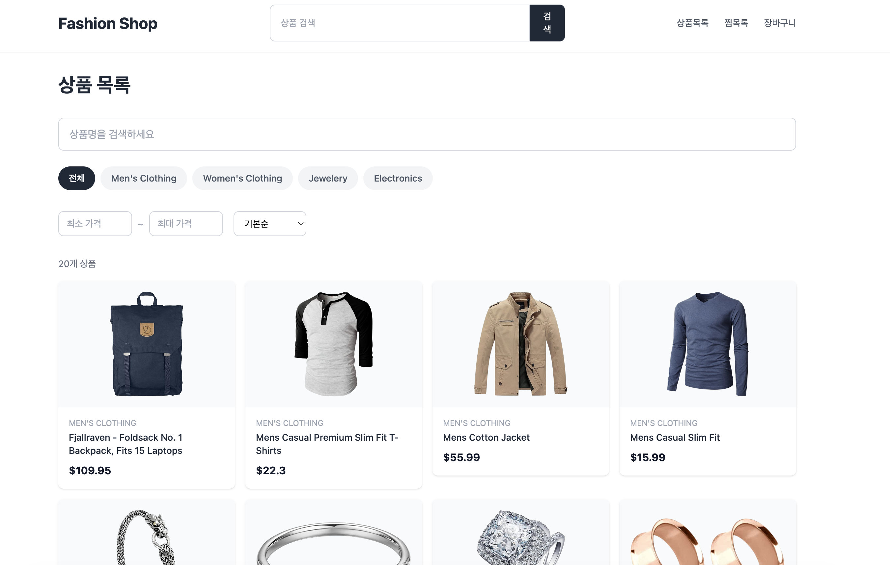
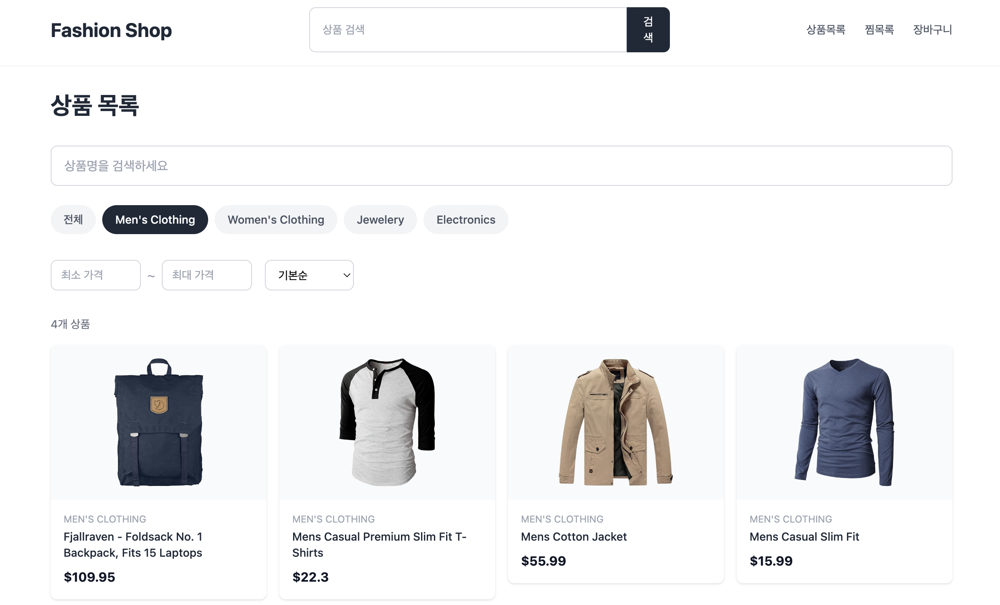
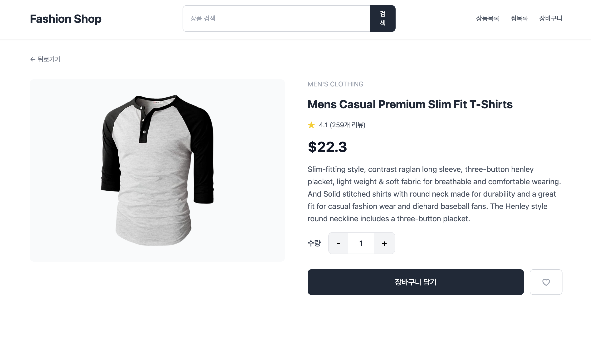
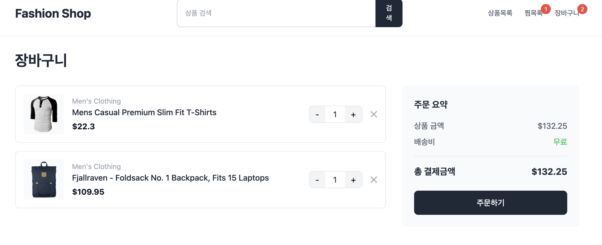
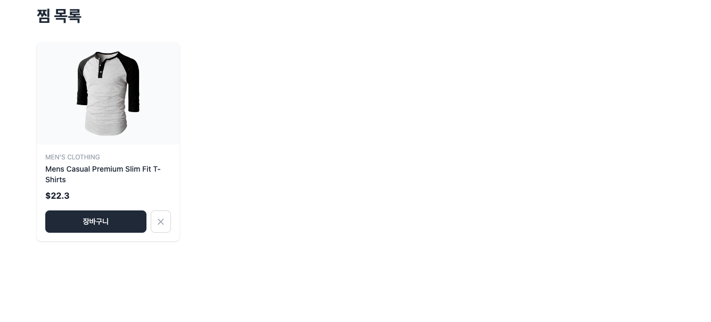
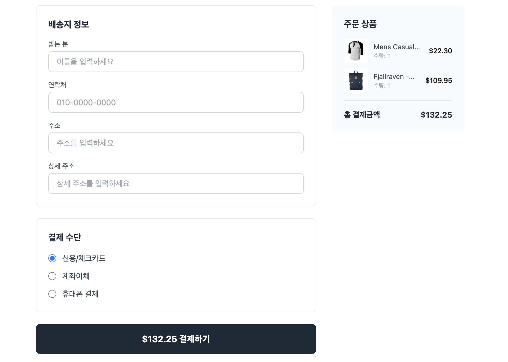
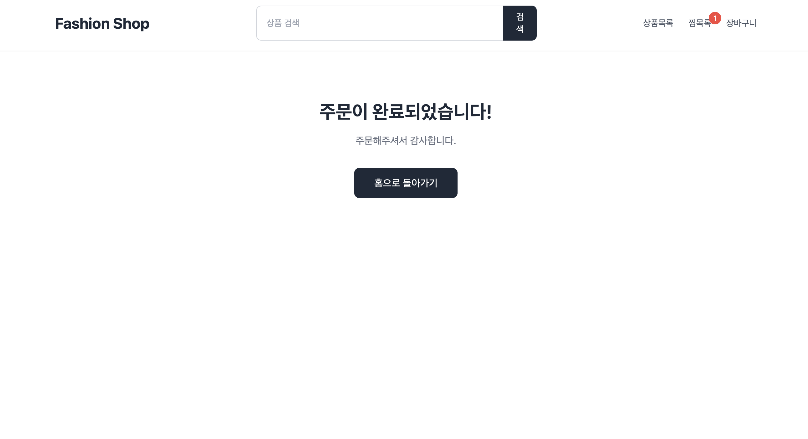

# 🛍️ Fashion Shop

Fake Store API를 활용한 React 기반 패션 쇼핑몰 프로젝트입니다.

## 📌 프로젝트 소개

React의 핵심 개념(Context API, Custom Hook, React Router 등)을 활용하여
실제 쇼핑몰과 유사한 기능을 구현한 포트폴리오 프로젝트입니다.

## ✨ 주요 기능

- 🏠 홈 페이지 - 베스트 상품, 신상품, 카테고리 바로가기
- 📋 상품 목록 - 카테고리 필터, 가격 필터, 검색, 정렬
- 🔍 상품 상세 - 상품 정보, 수량 선택, 평점
- 🛒 장바구니 - 상품 추가/삭제/수량 변경, 총 금액 계산
- ❤️ 찜 목록 - 찜하기/취소, 장바구니 바로 담기
- 📦 주문/결제 - 배송지 입력, 결제 수단 선택, 주문 완료
- 🔎 헤더 검색 - 검색어로 상품 목록 페이지 이동
- 📱 반응형 디자인 - 모바일/태블릿/데스크탑 지원

## 🛠️ 기술 스택

| 분류     | 기술                                       |
| -------- | ------------------------------------------ |
| Frontend | React 18, Vite                             |
| Routing  | React Router v6                            |
| 상태관리 | Context API, Custom Hooks                  |
| 스타일링 | Tailwind CSS v3                            |
| HTTP     | Axios                                      |
| 아이콘   | React Icons                                |
| 배포     | Vercel                                     |
| API      | [Fake Store API](https://fakestoreapi.com) |

## 📁 폴더 구조

```
src/
├── api/          # API 호출 함수
├── components/   # 공통 컴포넌트
│   └── common/
├── contexts/     # Context API
├── hooks/        # Custom Hooks
├── pages/        # 페이지 컴포넌트
└── utils/        # 유틸리티 함수
```

## 📷 스크린샷

| 홈 페이지                       | 상품 목록                             |
| ------------------------------- | ------------------------------------- |
|  |  |

| 상품 상세                         | 장바구니                              |
| --------------------------------- | ------------------------------------- |
|  |  |

| 찜 목록                         | 주문 페이지                       |
| ------------------------------- | --------------------------------- |
|  |  |

| 주문 완료                              |
| -------------------------------------- |
|  |

## 🔗 배포 링크
[Fashion Shop 바로가기](https://fashion-shop-project-tau.vercel.app/)
